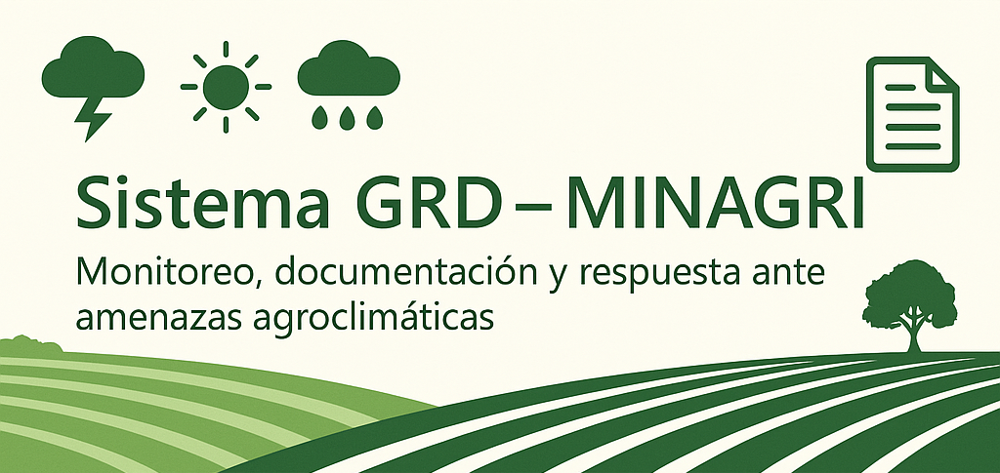

  

# 🌾 Sistema GRD - MINAGRI

Bienvenido al repositorio de la **maqueta funcional del Sistema de Gestión del Riesgo de Desastres (GRD)** para el Ministerio de Agricultura (MINAGRI). Esta maqueta fue desarrollada como parte de una propuesta técnica para la licitación pública, con el objetivo de presentar una visión clara, moderna y funcional del sistema.

---

## 🎯 Objetivo del Proyecto

El Sistema GRD busca fortalecer la capacidad del MINAGRI para monitorear, documentar y responder a amenazas agroclimáticas que afectan al sector agrícola. Esta maqueta estática representa una interfaz inicial para:

- Visualizar amenazas y eventos climáticos.
- Acceder a documentos técnicos y reportes históricos.
- Consultar indicadores agroclimáticos clave.

---

## 🧱 Estructura de la Maqueta

| Archivo              | Descripción                                                                 |
|----------------------|------------------------------------------------------------------------------|
| `index.html`         | Página de inicio con presentación institucional y navegación principal.     |
| `monitoreo.html`     | Módulo de monitoreo de amenazas agroclimáticas.                             |
| `repositorio.html`   | Repositorio documental con enlaces y fechas.                                |
| `indicadores.html`   | Nuevo módulo con indicadores climáticos relevantes.                         |
| `meteorologia.html`  | Nuevo módulo con información meteorológica local.                         |
| `style.css`          | Hoja de estilos unificada con diseño institucional y responsivo.            |

---

## 🚀 Despliegue en GitHub Pages

Puedes visualizar esta maqueta directamente desde GitHub siguiendo estos pasos:

1. Clona o descarga este repositorio.
2. Sube el contenido a un nuevo repositorio en tu cuenta de GitHub.
3. Ve a **Settings > Pages** y selecciona la rama `main` y carpeta raíz (`/root`).
4. Accede a la URL generada por GitHub Pages para ver la maqueta en línea (https://curoifu.github.io/Sistema-GRD-MINAGRI/).

---

## 🖌️ Diseño y Estilo

- Paleta institucional basada en el verde MINAGRI (`#006837`).
- Tipografía moderna y legible (`Segoe UI`, `Tahoma`).
- Diseño responsivo para dispositivos móviles.
- Navegación clara y accesible.
- Tablas estilizadas y jerarquía visual coherente.

---

## 👥 Créditos

Este prototipo fue desarrollado por el equipo de diseño y desarrollo UI/UX del CIT-UAI como parte de una propuesta técnica para el MINAGRI.

---

## 📌 Notas

- Esta maqueta es completamente estática y no requiere backend.
- Puede ser extendida fácilmente con datos dinámicos, mapas interactivos o formularios.
- Compatible con navegadores modernos y dispositivos móviles.

---

¡Gracias por revisar nuestra propuesta! 🌱
